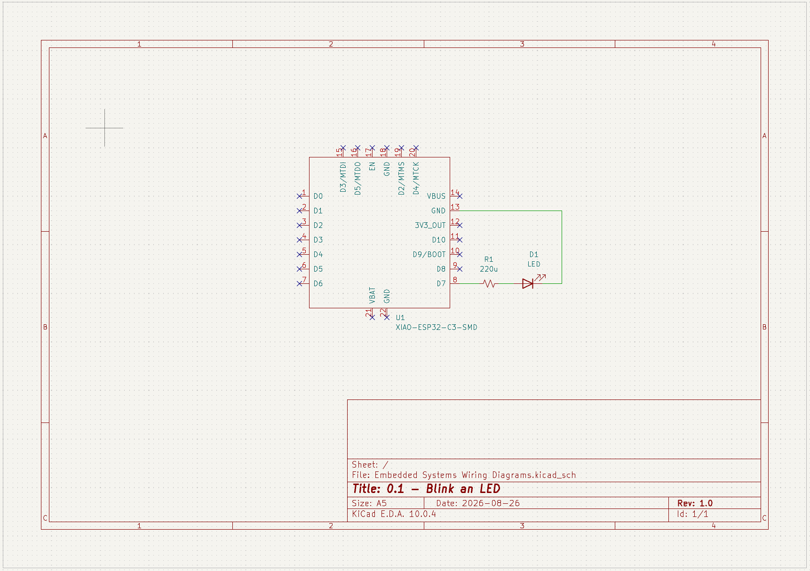

## 0.1 - Blink an LED

Blink an LED once every second indefinitely. 

## Wiring Diagram

Microcontroller was wired together with the LEDs on a breadboard. Microcontroller used was a [SEEED Studio XIAO ESP32-C3](https://wiki.seeedstudio.com/XIAO_ESP32C3_Getting_Started/). 

<!-- markdown format for an image -->

_Wiring diagram was created in KiCad Schematic Editor._

## What I learned
- I had a little trouble selecting the XIAO ESP32C3 board, but I was able to flash it after that. 
- I used basic [`delay()`](https://docs.arduino.cc/language-reference/en/functions/time/delay/) to accomplish the waiting. 