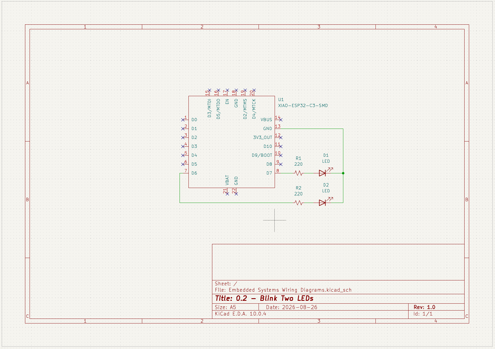

## 0.2 - Blink Two LEDs

Blink two LEDs together once every second indefinitely. 

## Wiring Diagram

Microcontroller was wired together with the LEDs on a breadboard. Microcontroller used was a [SEEED Studio XIAO ESP32-C3](https://wiki.seeedstudio.com/XIAO_ESP32C3_Getting_Started/). 

<!-- markdown format for an image -->

_Wiring diagram was created in KiCad Schematic Editor._

## What I learned
- Just simply adding the pinout for the second LED. Very easy progression from the previous task. 