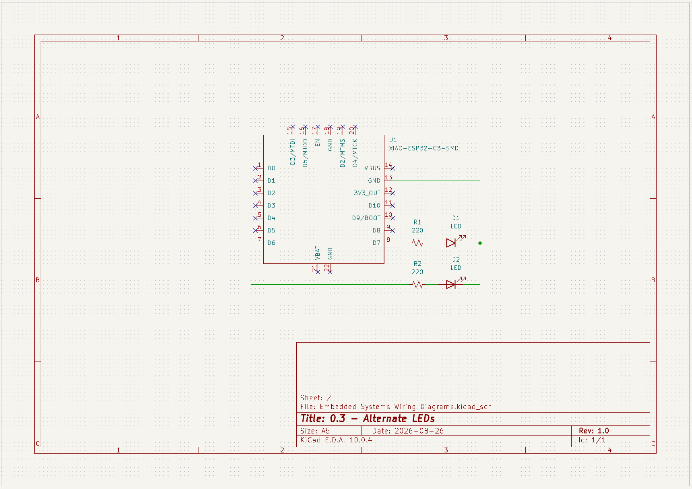

## 0.3 - Alternate LEDs

Using two LEDs, alternate which one is on and which one is off. 

## Wiring Diagram

Microcontroller was wired together with the LEDs on a breadboard. Microcontroller used was a [SEEED Studio XIAO ESP32-C3](https://wiki.seeedstudio.com/XIAO_ESP32C3_Getting_Started/). 

<!-- markdown format for an image -->

_Wiring diagram was created in KiCad Schematic Editor._

## What I learned
- Very easy continuation of the previous task. 
- Just needed to make sure that one LED was on while the other was off. 