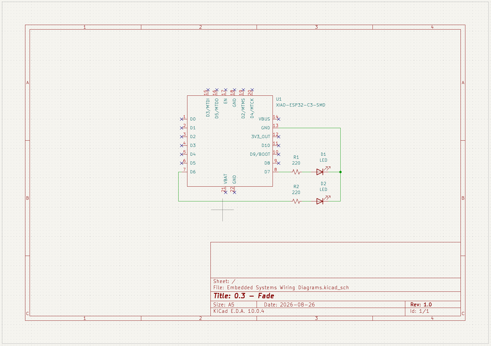

## 0.4 - Fade an LED

Gradually increase and decrease the brightness of an LED from 0% to 100%. 

## Wiring Diagram

Microcontroller was wired together with the LEDs on a breadboard. Microcontroller used was a [SEEED Studio XIAO ESP32-C3](https://wiki.seeedstudio.com/XIAO_ESP32C3_Getting_Started/). 

<!-- markdown format for an image -->

_Wiring diagram was created in KiCad Schematic Editor._

## What I learned
- Took me a while to figure out how to do PWM with arduino C++. Once I found the [`analogWrite()`](https://docs.arduino.cc/language-reference/en/functions/analog-io/analogWrite/) command, I was good to go. 
- I'm much more clear on how Pulse Width Modulation works after reading the docs on `analogWrite()`, and supplemental [PWM Documentation from Arduino docs](https://docs.arduino.cc/learn/microcontrollers/analog-output/). 
- I also needed to reference the XIAO ESP32-C3 docs to confirm all GPIO pins were capable of PWM - [board specifications](https://wiki.seeedstudio.com/XIAO_ESP32C3_Getting_Started/#specifications).
- Since I still had the green LED connected to the circuit, I disabled it since it would've remained on otherwise.