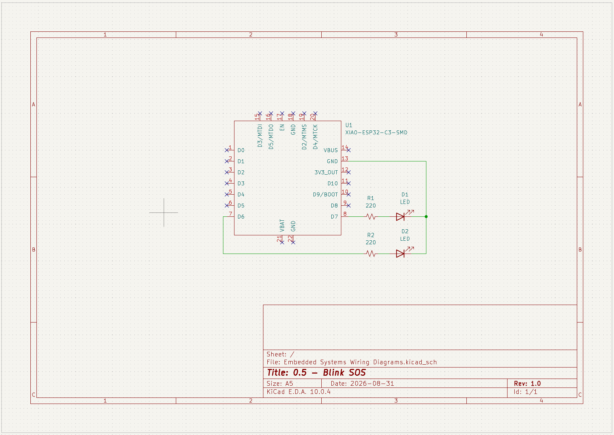

## 0.5 - Blink SOS

Blink an LED in the sequence of SOS morse code. 

## Wiring Diagram

Microcontroller was wired together with the LEDs on a breadboard. Microcontroller used was a [SEEED Studio XIAO ESP32-C3](https://wiki.seeedstudio.com/XIAO_ESP32C3_Getting_Started/). 

<!-- markdown format for an image -->

_Wiring diagram was created in KiCad Schematic Editor._

## What I learned
- Referenced [this website](https://www.morsehub.com/morse-code-timing-rules) for how long dots, dashes, and spaces should be. 
- I played around a bit with `millis()` but ultimately just stuck with using `delay()` calls instead. I will investigate `millis()` further in future objectives. 
- Timing took a bit of refinement, but happy with the results (100ms was too fast, 130ms was much better). 
- I like how I broke out the morse units based on the previously mentioned website. Easier to adjust timings with that setup than things being hardcoded. 
